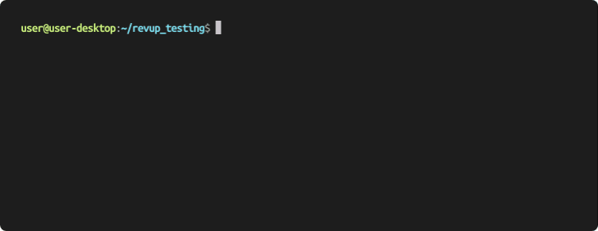
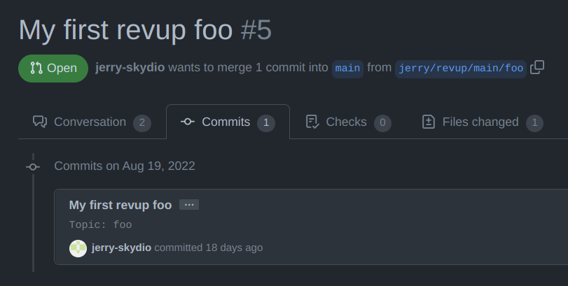
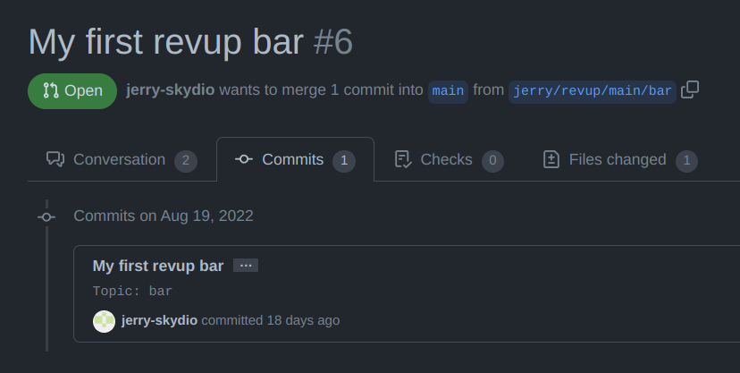
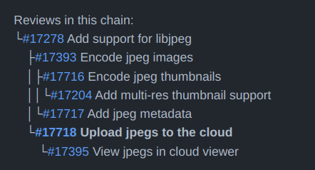
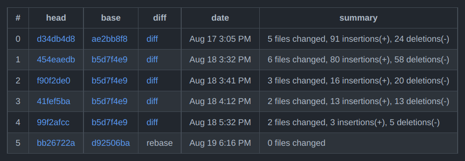

<p align="center">
<!-- PYPI_REMOVE -->
<picture>
  <source media="(prefers-color-scheme: dark)" srcset="docs/images/revup_dark.svg">
  <source media="(prefers-color-scheme: light)" srcset="docs/images/revup_light.svg">
<!-- /PYPI_REMOVE -->
  
<!-- PYPI_REMOVE -->
</picture>
<!-- /PYPI_REMOVE -->
</p>

<p align="center">
<a href="https://github.com/Skydio/revup"></a>
<a href="https://github.com/Skydio/revup/issues"></a>

<a href="https://pypi.org/project/revup/"></a>
<a href="https://github.com/Skydio/revup/tree/main/LICENSE"></a>
</p>

Revup provides command-line tools that allow developers to iterate faster on parallel changes and reduce the overhead of creating and maintaining code reviews.

<p align="center">

</p>

# Features

- Revup creates multiple independent chains of branches for you in the background and without touching your working tree. It then creates and manages github pull requests for all those branches.
- Pull requests target the actual base branch and can be merged manually or by continuous integration
- Rebase detection saves time and continuous integration cost by not re-pushing if the patch hasn't changed
- Adds reviewers, labels, and creates drafts all from the commit text
- Adds auto-updating "review graph" and "patchsets" elements to make pull requests easier to navigate
- `revup amend` and `revup restack` save time by replacing slow rebases

# Compatibility

Revup requires python 3.8 or higher and git 2.36 or higher. Revup works with Linux, OSX, and Windows (limited testing).

Follow instructions [here](https://git-scm.com/downloads) to get the latest git version for your OS. Revup uses flags only present in newer git versions.

# Installing

Install with `pip` or your favorite package manager.

```sh
python3.8 -m pip install revup
```

Verify that installation was successful by showing the help page.

```sh
revup -h
```

You can also build from source to get the latest updates.

```
git clone https://github.com/Skydio/revup.git && cd revup
make deps && make package && make install
```

# Tutorial

This tutorial will guide you through using basic revup features.

## First time setup

Clone a sandbox repo by [forking](https://github.com/Skydio/revup/fork) revup, creating a [new](https://github.com/new) repo, or using some other repo you own.
Creating test PRs can be spammy so don't do the tutorial on other people's repos.

```sh
git clone https://github.com/<your-name>/revup.git && cd revup
```

On first run, revup will prompt you to add github credentials
```sh
revup upload
```
Create a personal access token [here](https://github.com/settings/tokens/new) and check the box for "full repo permissions". Revup needs this in order to create and modify pull requests.

## Create independent pull requests

Make your first two commits that will become two separate pull requests.
Note the "Topic:" tag in the commit message - this is what causes revup to recognize and act on a commit.
Each separately named topic will become a new pull request.

```sh
echo meh > foo; git add foo
git commit -m "My first revup foo" -m "Topic: foo"
echo peh > bar; git add bar
git commit -m "My first revup bar" -m "Topic: bar"

revup upload
```


You've uploaded your first revup changes! Notice how in github, both branches target 'main'. This allows them to be merged independently.



Under the hood, revup creates and pushes these branches for you, tracking and managing the dependencies as needed.

## Create relative pull requests

Now we'll make a new review that's relative to "foo". The "Relative" tag will ensure the new review targets the correct branch.

```sh
echo deh >> foo; git add foo
git commit -m "My second revup foo" -m "Topic: foo2" -m "Relative: foo"

revup upload
```


With this simple but powerful model, you can upload independent and dependent changes all at once.

- Multiple commits can be in one topic, in which case they will all be in a single pull request.
- Commits in the same topic do not need to be adjacent in history.
- Topics relative to each other do not need to be adjacent in history, but the second topic must come after the first.

## Modify pull requests

Now let's update a pull request.

```sh
echo heh >> bar; git add bar
# Either
revup amend HEAD~ --no-edit  # Specify a commit to amend
# or
revup amend bar --no-edit  # Specify a topic name to amend

revup upload
```


`revup amend` makes it easy to modify commits in your history. You also have other options for modifying reviews:

- Adding new commits with the same topic
- Using `git rebase --interactive` along with `git commit --amend`

## Pulling in upstream changes

Use `git pull --rebase` to pull in changes. Don't use `git merge` or `git pull` without rebase as this creates a merge commit.

By default revup will not upload if you pull but haven't made changes to a commit. To override this and upload always, run `revup upload --rebase`.

```
[pull]
    rebase = true
[rebase]
    autoStash = true
```
We recommend adding the above to `.gitconfig` to make pulling and rebasing easier.

# More features

This is a non-exhausive intro to some more handy revup features.

For a full description of features, see the [docs](https://github.com/Skydio/revup/tree/main/docs) or run `revup -h` or `revup upload -h` to view docs in `man` format.

## Work with forks

For contributing to projects that you may not have push access to, revup can be configured to push to a fork while creating a pull request in the main project.

Add git remotes for both the original and fork.
```
$ git remote -v
origin  https://github.com/ORIGINAL_OWNER/REPO_NAME.git (fetch)
origin  https://github.com/ORIGINAL_OWNER/REPO_NAME.git (push)
myfork  https://github.com/YOUR_USERNAME/REPO_NAME.git (fetch)
myfork  https://github.com/YOUR_USERNAME/REPO_NAME.git (push)
```

When uploading, pass the remote to create the pull request in as `--remote-name` and the forked remote as `--fork-name`.
```
revup --remote-name origin --fork-name myfork upload
```

## Add reviewers / labels

Revup can also add reviewers, assignees, and labels to pull requests. Add the appropriate tags to any commit in a topic.

```
Reviewers: alice, bob
Assignees: eve
Labels: bug, feature, draft
```

Github usernames can be abbreviated and will match the shortest name with the given prefix.

Labels must match exactly. The `draft` label is special and will make a pull request a draft if present and unmake draft if removed.

## Working on other branches

Revup normally auto-detects your local base branch and uses that to list commits and target reviews.
You can choose to target any particular topic to another branch or even multiple branches, in which case revup will use those as the base branch instead (and create multiple pull requests in the latter case).

```
A fix for multiple branches

Topic: fix
Branches: main, rel1.1
```

You can specify base branch on the command line as well, although this is usually not necessary unless you're working on a branch that the autodetector doesn't know about (see Repo config below).

```
revup upload --base-branch custom-branch-name
```

## Review graph and patchsets

Revup will add 2 comments in every pull request to provide helpful features for users and reviewers. These are enabled by default and automatically updated as the pull request changes.



The review graph provides links and titles to all local pull requests that have a relative relationship with the current pull request, including any that it depends on, or that depend on it. This allows you to quickly browse between pull requests in a chain.



The patchsets table provides a history of uploads for a given pull request as well as links and summaries of the diff between each upload. Notably, revup specially handles
the case where you rebase then upload and will show you a diff with upstream files excluded.

# Configuring revup

Revup is highly configurable using a standard config file format. Every flag is also a config option, so users can get the exact behavior they need.

Flags specified on the command line take precedence, followed by config in `~/.revupconfig`, followed by `.revupconfig` in the current repo.

## Repo config

The primary usecase for the in-repo config file is setting up the naming of the main branch and release branches.

For example if your main branch is `master` and release branches are named like `rel1.1`, commit the following to `.revupconfig` in the repo root.

```
[revup]
main_branch = master
base_branch_globs =
    rel[1-9].[0-9]
    rel[1-9].[0-9][0-9]
```

## User config

The user config at `~/.revupconfig` saves time by defaulting the most commonly used flags.

For example, after getting used to the workflow, a user might not need the confirmation check. Adding the following lines will be the same as running with `--skip-confirm`.

```
[upload]
skip_confirm = True
```

# Appendix

## Commit based development

(aka "stacked diffs", "patch based", etc)

If you've used tools such as Gerrit, Phabricator, or git mailing lists, you may already be familiar with this style of development. If you'd like to read more, here are some well written discussions on the subject.

- [Stacked Diffs vs Pull Request](https://jg.gg/2018/09/29/stacked-diffs-versus-pull-requests/)
- [In Praise of Stacked PRs](https://benjamincongdon.me/blog/2022/07/17/In-Praise-of-Stacked-PRs/)

## Peer projects

Revup is inspired in part by this non-exhaustive list of open source projects that also support a patch based workflow:

- [ghstack](https://github.com/ezyang/ghstack): also a patched based tool integrated with github. revup builds on code from this project, especially graphql usage.
- [git-branchstack](https://github.com/krobelus/git-branchstack): creates branches similar to `revup upload` but doesn't push or create reviews.
- [git-revise](https://github.com/mystor/git-revise): similar to `revup amend` and the backend for the above with a merge system that handles conflicts

## Contributing & support

Thanks for contributing to revup! You can get started with your own idea, or see the [issues](https://github.com/Skydio/revup/issues) page for ideas that other people are excited about.

When reporting issues:
- Check the issue tracker to see if it has already been reported.
- Provide a description of repro steps.
- If possible, run the same command with `revup -v` to provide verbose logs.

## Disclaimer

Revup is published by Skydio but is not an officially supported Skydio product.
